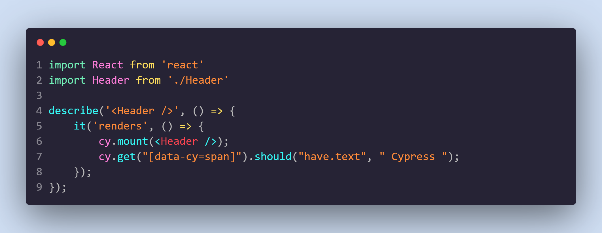
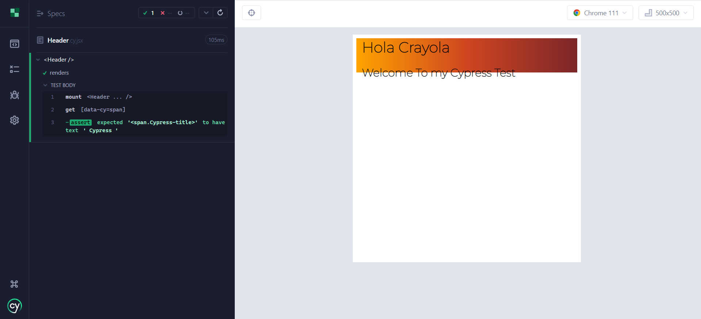

# M5: Activity 1 - Perform a String recognition using Selenium or similar technology
Vicente Javier Viera Guízar | A01639784
## Code

## Working Project
GitHub: https://github.com/VicenteVieraG/503_Homework/tree/main/cypress/cypressTest  
Screen shots:

## How it works?
In this test the component __Header__ is being tested. First Cypress loads the component in it´s browser and then it finds within the component a tag with the __data-cy__ prop being equal to "span". After this success it verifies if it contains the text " Cypress ". It can either assert or fail the test. In this case the test is asserted. 